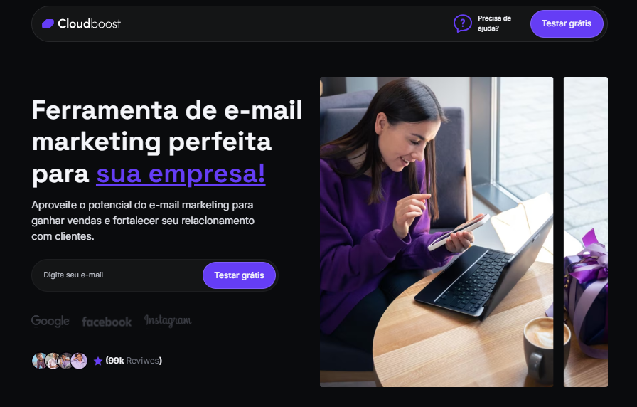

# Projeto - CloudBoost

## Sobre o Projeto 🚀

Esse projeto foi desenvolvido como parte do curso Codeboost, ministrado pelo professor William Moreira. Esse é o segundo projeto prático do curso, que consiste em desenvolver uma landing page utilizando o SaaS, que permite a otimização do desenvolvimento.

Nesse projeto, aprendi como o SaaS pode facilitar o desenvolvimento do projeto, permitindo a criação de funções reutilizáveis em outras partes do código, tornando o processo mais dinâmico e eficiente. Para as animações, utilizei a biblioteca <a href="https://michalsnik.github.io/aos/">AOS Animate</a>. O layout foi disponibilizado no curso e é de autoria do mesmo.

## Tecnologias

Nesse projeto foram utilizados as seguintes tecnologias:

 

 
## Deploy

O deploy do projeto pode ser visualizado através do link: <a href="https://cloudboost-omega.vercel.app/">CloudBoost</a>

## Contato

 
   
     

